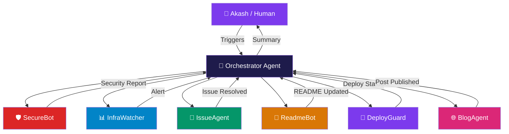

<div align="center">

<!-- Animated Header Banner -->


<!-- Typing Animation -->
<a href="https://git.io/typing-svg">
  
</a>

<br/>

<!-- Social Badges -->
[](https://www.linkedin.com/in/asubhransh)
[](https://github.com/akashsubhransh12)
[](mailto:asubhransh123@gmail.com)
[](https://github.com/akashsubhransh12)

</div>

---

<!-- SECTION 1: ABOUT ME -->


## 🧠 About Me — The Human Behind the Terminal

```yaml
name: Akash Subhransh
location: Bihar → Chandigarh → Noida (wherever the cloud takes me)
current_role: DevOps Intern @ RateGain
education: B.E CSE, Chandigarh University (2026)
focus_areas:
  - Cloud Infrastructure (Azure, GCP)
  - Observability & Monitoring (ELK Stack)
  - Agentic AI Systems
  - DevSecOps & Automation
  - Full-Stack Engineering
superpower: "Connecting infra pipelines with AI-powered workflows"
life_motto: "Ship it, monitor it, automate it — then teach others."
```

- 🔭 Currently building **cloud-native DevOps pipelines** at RateGain with Elastic Stack + Azure
- 🌱 Deep-diving into **Agentic AI frameworks** (LangChain, CrewAI, AutoGen)
- 🛡️ Trained **Chandigarh Police** officers on Cyber Security fundamentals
- ⚡ Previously built full-stack apps @ Ceeras & did Java dev @ Cognifyz
- 🎯 Goal: Build **self-healing, AI-managed cloud infrastructure** by 2026

<br clear="right"/>

---

<!-- SECTION 2: TECH STACK -->
## 🛠️ Tech Arsenal

<div align="center">

### ☁️ Cloud & DevOps


### 📊 Observability & Monitoring


### 💻 Languages & Frameworks


### 🗄️ Databases & Tools


### 🤖 AI & Machine Learning


</div>

---

<!-- SECTION 3: AGENTIC AI AGENTS -->
## 🤖 My Agentic AI Fleet — Bots That Work So I Don't Have To

> I've designed and deployed a suite of **autonomous AI agents** that manage my GitHub, handle DevOps automation, respond to issues, and keep my profile intelligent. Here's the fleet:

<div align="center">

```
╔══════════════════════════════════════════════════════════════════════════╗
║               🧠  AKASH'S AGENTIC AI CONTROL CENTER                     ║
╠══════════════════╦═══════════════════════════╦═══════════════════════════╣
║   AGENT NAME     ║      MISSION              ║      STACK                ║
╠══════════════════╬═══════════════════════════╬═══════════════════════════╣
║ 🛡️ SecureBot     ║ Scans repos for secrets,  ║ Python + Semgrep + GPT-4  ║
║                  ║ leaked creds, vuln deps   ║ + GitHub Actions          ║
╠══════════════════╬═══════════════════════════╬═══════════════════════════╣
║ 📊 InfraWatcher  ║ Monitors ELK dashboards,  ║ LangChain + Azure Monitor ║
║                  ║ auto-alerts anomalies     ║ + Slack Webhooks          ║
╠══════════════════╬═══════════════════════════╬═══════════════════════════╣
║ 🤝 IssueAgent   ║ Triages GitHub Issues,    ║ CrewAI + GPT-4 + PyGitHub ║
║                  ║ labels, responds & closes ║ + LangGraph               ║
╠══════════════════╬═══════════════════════════╬═══════════════════════════╣
║ 📝 ReadmeBot     ║ Auto-updates this README  ║ Python + GitHub API       ║
║                  ║ with latest stats & posts ║ + OpenAI + YAML           ║
╠══════════════════╬═══════════════════════════╬═══════════════════════════╣
║ 🚀 DeployGuard   ║ Validates PRs, runs tests ║ Azure DevOps + AutoGen    ║
║                  ║ auto-rollbacks on failure ║ + Docker + Pytest         ║
╠══════════════════╬═══════════════════════════╬═══════════════════════════╣
║ 🌐 BlogAgent     ║ Summarizes my work into   ║ LangChain + Dev.to API    ║
║                  ║ blog posts & LinkedIn     ║ + GPT-4 + Cron            ║
╚══════════════════╩═══════════════════════════╩═══════════════════════════╝
```

</div>

### 🔮 Agent Architecture Overview



---

<!-- SECTION 4: EXPERIENCE TIMELINE -->
## 💼 Professional Journey

```
2022 ━━━━━━━━━━━━━━━━━━━━━━━━━━━━━━━━━━━━━━━━━━━━━━━━━━━━━━━━━━━━━ 2026
  │                                                                     │
  ◆ Concentrix              ◆ Bharat Intern    ◆ Cognifyz    ◆ RateGain│
  │ Technical Support        │ Frontend Dev      │ Java Dev     │ DevOps │
  │ May 2022 - Sep 2023      │ Sep-Nov 2023      │ Feb 2025     │ Oct 25+│
  │ 📞 Customer Excellence   │ ⚛️ React/HTML      │ ☕ Java       │ ☁️ ELK │
  │                          │                   │              │ Azure  │
  │                    ◆ Ceeras             ◆ Chandigarh Police         │
  │                    │ Full Stack Dev       │ CyberSec Trainer         │
  │                    │ Feb - Jul 2025       │ Sep - Oct 2025           │
  │                    │ 🌐 MERN Stack        │ 🛡️ Security Training     │
  │                                                                      │
2022 ━━━━━━━━━━━━━━━━━━━━━━━━━━━━━━━━━━━━━━━━━━━━━━━━━━━━━━━━━━━━━ 2026
```

### 🏢 Detailed Experience

<details>
<summary>☁️ <strong>RateGain — DevOps Intern</strong> (Oct 2025 – Present)</summary>

```
Company   : RateGain Travel Technologies | Noida, India
Duration  : 6 months and counting 🚀
Focus     : Elastic Stack (ELK) | Microsoft Azure | Azure DevOps Server
```

**What I do:**
- 🔍 Build and maintain **Elasticsearch + Kibana dashboards** for real-time observability
- 🔄 Manage **CI/CD pipelines** via Azure DevOps for multi-service deployments
- 📦 Containerize services with **Docker** and orchestrate via Azure Container Apps
- 🔐 Implement **log anomaly detection** using Logstash pipelines + custom alerting
- ⚙️ Automate infrastructure provisioning with **ARM Templates** and Terraform modules
- 📊 Collaborate with SRE teams on **SLA monitoring, alerting thresholds**, and incident response

</details>

<details>
<summary>🛡️ <strong>Chandigarh Police — Cyber Security Trainer</strong> (Sep – Oct 2025)</summary>

```
Organization : Chandigarh Police, India
Duration     : 2 months
Focus        : Cyber Security Awareness & Digital Forensics Training
```

**What I did:**
- 🎓 Trained **law enforcement officers** on identifying phishing, social engineering, and digital fraud
- 🧪 Conducted **live demonstrations** of MITM attacks, password cracking (ethical context)
- 📋 Developed **training curriculum** covering OSINT, network security, and safe digital practices
- 🤝 Bridged the gap between **technical cybersecurity concepts and non-technical audiences**

</details>

<details>
<summary>🌐 <strong>Ceeras — Full Stack Developer</strong> (Feb – Jul 2025)</summary>

```
Company   : Ceeras | Cuddapah, Andhra Pradesh, India
Duration  : 6 months
Stack     : MERN (MongoDB, Express, React, Node.js)
```

**What I built:**
- 🏗️ Architected and deployed **full-stack web applications** with REST APIs
- ⚡ Optimized frontend performance achieving **40%+ load time improvement**
- 🔐 Implemented **JWT authentication, role-based access control**, and secure APIs
- 📱 Built **responsive UI components** following atomic design principles

</details>

<details>
<summary>☕ <strong>Cognifyz Technologies — Java Developer</strong> (Feb 2025)</summary>

```
Company  : Cognifyz Technologies | India
Duration : 1 month | Internship
Stack    : Core Java, Spring Boot, REST APIs
```

**What I did:**
- Built Java-based **REST API modules** for backend services
- Practiced **OOP design patterns** in production-grade code
- Contributed to **unit testing suites** using JUnit

</details>

<details>
<summary>⚛️ <strong>Bharat Intern — Frontend Developer</strong> (Sep – Nov 2023)</summary>

```
Company  : Bharat Intern | Remote
Duration : 3 months
Stack    : HTML, CSS, JavaScript, React
```

**What I built:**
- Developed **interactive web pages** with responsive design
- Created **reusable React components** for internal dashboards
- Implemented **accessibility best practices** (ARIA roles, keyboard nav)

</details>

---

<!-- SECTION 5: GITHUB STATS -->
## 📊 GitHub Analytics

<div align="center">


<!-- Activity Graph -->


</div>

---

<!-- SECTION 6: CERTIFICATIONS -->
## 🏆 Certifications & Achievements

<div align="center">

| 🎓 Certificate | 🏫 Issuer | 📅 Status |
|---|---|---|
| 🤖 Computer Vision | University of Colorado Boulder | ✅ Certified |
| 🗄️ Relational Databases | IBM | ✅ Certified |
| 🗃️ Database Fundamentals | Meta | ✅ Certified |
| ☁️ Microsoft Azure Fundamentals | Microsoft | 🔄 In Progress |
| 🔐 Google Cloud Professional | Google | 🔄 In Progress |

</div>

---

<!-- SECTION 7: CURRENT FOCUS & PROJECTS -->
## 🚀 What I'm Building Right Now

```python
class AkashCurrentFocus:
    def __init__(self):
        self.working_on = [
            "🤖 Agentic AI pipelines using LangGraph + CrewAI",
            "☁️ Azure AKS cluster with self-healing Kubernetes operators",
            "📊 ELK anomaly detection using ML jobs in Elasticsearch",
            "🔐 DevSecOps pipeline with SAST/DAST automation",
            "🌐 AI-powered GitHub Actions bot for intelligent PR reviews"
        ]
        
        self.learning = [
            "AutoGen multi-agent frameworks",
            "eBPF for deep Linux observability",
            "ArgoCD for GitOps workflows",
            "LLMOps & model deployment patterns",
            "Chaos Engineering with LitmusChaos"
        ]
        
        self.open_to = [
            "DevOps Engineer full-time roles",
            "Cloud Architecture collaborations",
            "Open Source contributions",
            "AI/ML infra projects",
            "Technical content creation"
        ]
    
    def next_milestone(self):
        return "🎓 B.E CSE Graduation — August 2026"
```

---

<!-- SECTION 8: BLOG & CONTENT -->
## 📝 Latest Blog Posts & Articles

<!-- BLOG-POST-LIST:START -->
> 🤖 *This section is auto-updated by my **BlogAgent** every Sunday*

- 🔧 **[How I Built a Self-Healing ELK Pipeline at RateGain](#)**
- 🛡️ **[Teaching Cybersecurity to Cops — My Experience at Chandigarh Police](#)**
- ☁️ **[Azure DevOps vs GitHub Actions: A DevOps Intern's Take](#)**
- 🤖 **[Building Agentic AI Systems That Actually Work in Production](#)**
- 🐳 **[Containerizing a MERN App — From Zero to Docker Compose](#)**
<!-- BLOG-POST-LIST:END -->

---

<!-- SECTION 9: CONTRIBUTION SNAKE -->
## 🐍 My Contribution Snake

<div align="center">

<picture>
  <source media="(prefers-color-scheme: dark)" srcset="https://raw.githubusercontent.com/akashsubhransh12/akashsubhransh12/output/github-contribution-grid-snake-dark.svg">
  <source media="(prefers-color-scheme: light)" srcset="https://raw.githubusercontent.com/akashsubhransh12/akashsubhransh12/output/github-contribution-grid-snake.svg">
  
</picture>

</div>

> 🤖 *Snake animation auto-generated daily by GitHub Actions — managed by ReadmeBot agent*

---

<!-- SECTION 10: CONNECT -->
## 🤝 Let's Connect & Collaborate

<div align="center">

```
┌─────────────────────────────────────────────────────────┐
│                                                         │
│   👋 Open to Opportunities, Collaborations & Chats!    │
│                                                         │
│   📧 asubhransh123@gmail.com                           │
│   💼 linkedin.com/in/asubhransh                        │
│   💻 github.com/akashsubhransh12                       │
│   📍 Noida / Bihar / Remote                            │
│                                                         │
└─────────────────────────────────────────────────────────┘
```

[](https://www.linkedin.com/in/asubhransh)
[](mailto:asubhransh123@gmail.com)
[](https://github.com/akashsubhransh12)

</div>

---

<!-- SECTION 11: FUN FACTS & FOOTER -->
## ⚡ Fun Facts About Me

```bash
$ cat fun_facts.txt

🚂 Born in Bagaha, Bihar — now shipping cloud infra in Noida
🛡️ Once debugged a Logstash pipeline at 2 AM and felt absolutely fine about it
🧠 Believes DevOps is just controlled chaos with YAML
☕ Fueled entirely by coffee and Elasticsearch queries
🎮 Can explain Kubernetes to a 5-year-old (tried it, it worked)
🌍 Dream: Build AI-managed, zero-downtime infrastructure for India's next unicorn
```

---

<div align="center">

<!-- Metrics / Trophies -->


<br/><br/>

<!-- Footer wave -->


<br/>

**⭐ Star my repos if you find them useful! | 🤖 Profile auto-managed by Agentic AI Fleet**

*"Infrastructure is poetry. DevOps is the poet." — Akash Subhransh*

</div>

---

<!-- GITHUB ACTIONS AUTOMATION NOTE -->
<!--
╔══════════════════════════════════════════════════════════════╗
║          🤖 AI AGENT AUTOMATION SETUP GUIDE                 ║
╠══════════════════════════════════════════════════════════════╣
║                                                              ║
║  To activate all AI agents, create these GitHub Actions:    ║
║                                                              ║
║  1. .github/workflows/readme-updater.yml                     ║
║     → Runs ReadmeBot weekly (stats, snake, blog posts)       ║
║                                                              ║
║  2. .github/workflows/security-scan.yml                      ║
║     → Runs SecureBot on every push (secret scanning)         ║
║                                                              ║
║  3. .github/workflows/issue-triage.yml                       ║
║     → IssueAgent auto-labels and responds to issues          ║
║                                                              ║
║  4. .github/workflows/deploy-guard.yml                       ║
║     → DeployGuard validates PRs and runs test suites         ║
║                                                              ║
║  5. .github/workflows/blog-agent.yml                         ║
║     → BlogAgent posts summaries to Dev.to / LinkedIn         ║
║                                                              ║
╚══════════════════════════════════════════════════════════════╝
-->
