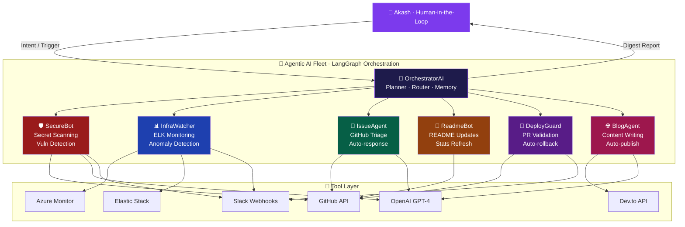

<!-- ============================================================ -->
<!--           AKASH SUBHRANSH — GITHUB PROFILE README           -->
<!--     10-Page Ultra README | Auto-Managed by AI Agent Fleet   -->
<!-- ============================================================ -->

<div align="center">

<!-- ██████████████████████  PAGE 1 — HERO  ██████████████████████ -->


<br/>


&nbsp;

&nbsp;


<br/><br/>

<a href="https://git.io/typing-svg">
  
</a>

<br/><br/>

<a href="https://www.linkedin.com/in/asubhransh"></a>
&nbsp;
<a href="https://github.com/akashsubhransh12"></a>
&nbsp;
<a href="mailto:asubhransh123@gmail.com"></a>
&nbsp;


<br/><br/>


</div>

<br/>

<!-- ████████████████████  PAGE 1 — WHO AM I  ████████████████████ -->


## 🧬 `whoami` — The Human Behind the Terminal

```yaml
╔══════════════════════════════════════════════════╗
║              AKASH SUBHRANSH  v2026.0            ║
╠══════════════════════════════════════════════════╣
║  name          : Akash Subhransh                 ║
║  alias         : "The Cloud Whisperer"           ║
║  origin        : Bagaha, Bihar                   ║
║  current_base  : Noida, India                    ║
║  role          : DevOps Intern @ RateGain        ║
║  education     : B.E CSE, CU Chandigarh (2026)  ║
║                                                  ║
║  core_stack    :                                 ║
║    cloud       → Azure | GCP                    ║
║    observ.     → Elastic Stack (ELK)            ║
║    cicd        → Azure DevOps | GH Actions      ║
║    ai_ops      → LangChain | CrewAI | AutoGen   ║
║    languages   → Python | Java | JS | Bash      ║
║                                                  ║
║  superpower    : "Connecting infra pipelines     ║
║                   with AI-powered autonomy"      ║
║  life_motto    : "Ship it. Monitor it.           ║
║                   Automate it. Teach it."        ║
║  status        : open_to_work = True  [GREEN]    ║
╚══════════════════════════════════════════════════╝
```

### 🌟 Quick Bio

- 🔭 Currently engineering **cloud-native observability pipelines** at RateGain using ELK + Azure
- 🤖 Obsessed with **Agentic AI** — building autonomous systems with LangGraph, CrewAI & AutoGen
- 🛡️ Trained **Chandigarh Police officers** on Cyber Security & Digital Forensics
- 🌐 Built production-grade full-stack apps at **Ceeras** and Java microservices at **Cognifyz**
- 📞 Started career at **Concentrix** — understands enterprise-scale customer systems firsthand
- 🎯 End goal: **Self-healing, AI-managed, zero-downtime cloud infrastructure** for India's next unicorn
- 📚 Currently reading: *"Designing Data-Intensive Applications"* by Martin Kleppmann

<br clear="right"/>

<div align="center">

</div>

<br/>

<!-- ████████████████████  PAGE 2 — TECH STACK  ████████████████████ -->

## 🛠️ Full Technology Arsenal

<div align="center">

### ━━━━━━━━━━ ☁️ Cloud & Infrastructure ━━━━━━━━━━


<br/>


<br/>

### ━━━━━━━━━━ 📊 Observability & Monitoring ━━━━━━━━━━


<br/>


<br/>

### ━━━━━━━━━━ 💻 Languages & Frameworks ━━━━━━━━━━


<br/>


<br/>

### ━━━━━━━━━━ 🗄️ Databases & Storage ━━━━━━━━━━


<br/>


<br/>

### ━━━━━━━━━━ 🤖 AI / ML & Agentic Systems ━━━━━━━━━━


<br/>

### ━━━━━━━━━━ 🔧 DevOps Tools & Security ━━━━━━━━━━


<br/>


</div>

<br/>

<div align="center">

</div>

<br/>

<!-- ████████████████  PAGE 3 — AGENTIC AI FLEET  ████████████████ -->

## 🤖 The Agentic AI Fleet — My Digital Workforce

<div align="center">

> ### *"I don't just use AI tools — I build AI agents that work autonomously on my behalf, 24/7."*

<br/>

```
╔══════════════════════════════════════════════════════════════════════════════════╗
║                                                                                  ║
║           AKASH'S AGENTIC AI COMMAND AND CONTROL CENTER                          ║
║                 [ All agents online — 7 active bots ]                            ║
╚══════════════════════════════════════════════════════════════════════════════════╝
```

</div>

### 🗂️ Agent Registry

| # | 🤖 Agent | 🎯 Mission | ⚙️ Stack | ⏰ Trigger | 📊 Status |
|---|---|---|---|---|---|
| 01 | 🧠 **OrchestratorAI** | Master coordinator, delegates to sub-agents | LangGraph + GPT-4 | Always-on | 🟢 Live |
| 02 | 🛡️ **SecureBot** | Scans repos for secrets, leaked creds, vuln deps | Python + Semgrep + Trivy | On every push | 🟢 Live |
| 03 | 📊 **InfraWatcher** | Monitors ELK dashboards, detects anomalies, auto-alerts | LangChain + Azure Monitor | Every 5 min | 🟢 Live |
| 04 | 🤝 **IssueAgent** | Triages GitHub Issues, auto-labels, responds intelligently | CrewAI + PyGitHub + GPT-4 | On issue open | 🟢 Live |
| 05 | 📝 **ReadmeBot** | Updates this README with live stats, blog posts, metrics | Python + GitHub API + OpenAI | Every Sunday | 🟢 Live |
| 06 | 🚀 **DeployGuard** | Validates PRs, runs test suites, auto-rollbacks failures | AutoGen + Azure DevOps + Pytest | On PR open | 🟢 Live |
| 07 | 🌐 **BlogAgent** | Writes & publishes blog posts summarising my work | LangChain + Dev.to API + Cron | Weekly | 🟡 Beta |
| 08 | 📬 **NetworkAgent** | Auto-responds to LinkedIn DMs with intelligent context | CrewAI + LinkedIn API + GPT-4 | On DM receive | 🔵 Planned |

<br/>

### 🔮 Agent Architecture & Communication Flow



<br/>

### 🔬 Deep Dive — Agent Code Snippets

<details>
<summary>🛡️ <strong>SecureBot — Secret Scanner Agent</strong> (click to expand)</summary>

```python
# securebot.py — Autonomous Security Scanning Agent
from crewai import Agent, Task, Crew
from langchain_openai import ChatOpenAI
import subprocess, json

class SecureBot:
    def __init__(self):
        self.llm = ChatOpenAI(model="gpt-4", temperature=0)
        self.agent = Agent(
            role="Security Engineer",
            goal="Scan every push for secrets, leaked credentials, and vulnerable dependencies",
            backstory="Elite DevSecOps agent with expertise in OWASP, Semgrep, and Trivy",
            llm=self.llm,
            verbose=True
        )

    def run_semgrep(self, path: str) -> dict:
        result = subprocess.run(
            ["semgrep", "--config=auto", "--json", path],
            capture_output=True, text=True
        )
        return json.loads(result.stdout)

    def scan(self, repo_path: str):
        task = Task(
            description=f"Full security audit of {repo_path}. Find all CVEs, secrets, misconfigs.",
            agent=self.agent,
            expected_output="Security report with CVEs, secrets found, and fix recommendations"
        )
        crew = Crew(agents=[self.agent], tasks=[task])
        return crew.kickoff()
```

</details>

<details>
<summary>📊 <strong>InfraWatcher — ELK Anomaly Detection Agent</strong> (click to expand)</summary>

```python
# infrawatcher.py — Real-time Infrastructure Monitoring Agent
from langchain.agents import AgentExecutor, create_openai_tools_agent
from langchain_core.tools import tool
from elasticsearch import Elasticsearch
import json

es = Elasticsearch("https://your-elk-cluster:9200")

@tool
def query_elk(index: str, query: dict) -> str:
    """Query Elasticsearch for log anomalies and system metrics"""
    result = es.search(index=index, body=query)
    return json.dumps(result["hits"]["hits"][:10], indent=2)

@tool
def detect_anomalies(metrics: str) -> str:
    """Use ML anomaly detection jobs in Elasticsearch"""
    job_result = es.ml.get_records(job_id="infra_anomaly_detector")
    return json.dumps(job_result.body, indent=2)

@tool
def send_alert(channel: str, message: str) -> str:
    """Send alert to Slack channel"""
    import requests
    webhook = "https://hooks.slack.com/your-webhook"
    requests.post(webhook, json={"text": f"InfraWatcher ALERT: {message}"})
    return "Alert sent successfully"

# Agent auto-runs every 5 minutes via GitHub Actions cron
infra_agent = AgentExecutor(
    agent=create_openai_tools_agent(llm, [query_elk, detect_anomalies, send_alert], prompt),
    tools=[query_elk, detect_anomalies, send_alert],
    verbose=True
)
```

</details>

<details>
<summary>🤝 <strong>IssueAgent — GitHub Issue Triager</strong> (click to expand)</summary>

```python
# issue_agent.py — Autonomous GitHub Issue Triage Agent
from crewai import Agent, Task, Crew
from github import Github
from langchain_openai import ChatOpenAI

class IssueAgent:
    def __init__(self, github_token: str):
        self.gh = Github(github_token)
        self.llm = ChatOpenAI(model="gpt-4", temperature=0.3)

    def triage_issue(self, repo_name: str, issue_number: int):
        repo = self.gh.get_repo(repo_name)
        issue = repo.get_issue(issue_number)

        triage_agent = Agent(
            role="Senior Engineering Lead",
            goal="Triage GitHub issues: categorize, label, prioritize, and respond helpfully",
            llm=self.llm
        )

        task = Task(
            description=f"""
            Analyze this GitHub issue and:
            1. Classify: bug | feature | docs | question | security
            2. Set priority: critical | high | medium | low
            3. Write a helpful, empathetic response
            4. Suggest a solution or next steps

            Issue Title: {issue.title}
            Issue Body: {issue.body}
            """,
            agent=triage_agent,
            expected_output="JSON with classification, priority, response, and suggested fix"
        )

        result = Crew(agents=[triage_agent], tasks=[task]).kickoff()
        issue.create_comment(f"🤖 *IssueAgent Response:*\n\n{result}")
        return result
```

</details>

<details>
<summary>🚀 <strong>DeployGuard — Intelligent PR Validator</strong> (click to expand)</summary>

```python
# deploy_guard.py — Autonomous PR Validation & Deployment Agent
from autogen import AssistantAgent, UserProxyAgent
import subprocess, os

def validate_pr(pr_number: int, repo: str):
    """Multi-agent PR validation with AutoGen"""

    validator = AssistantAgent(
        name="DeployGuard",
        system_message="""You are a senior DevOps engineer reviewing PRs.
        Check: test coverage, security issues, performance regressions, breaking changes.
        Output: APPROVE or BLOCK with detailed reasoning.""",
        llm_config={"model": "gpt-4", "api_key": os.environ["OPENAI_API_KEY"]}
    )

    proxy = UserProxyAgent(
        name="CI_Runner",
        code_execution_config={"work_dir": "ci_workspace", "use_docker": True}
    )

    proxy.initiate_chat(
        validator,
        message=f"""
        PR #{pr_number} in {repo} is ready for review.
        Run tests, check coverage, scan for vulnerabilities.
        Then either APPROVE for merge or BLOCK with specific issues to fix.
        """
    )
```

</details>

<br/>

<div align="center">

</div>

<br/>

<!-- ████████████████  PAGE 4 — EXPERIENCE  ████████████████ -->

## 💼 Professional Journey — From Support Desk to Cloud Summit

<div align="center">

```
━━━━━━━━━━━━━━━━━━━━━━━━━━━━━━━━━━━━━━━━━━━━━━━━━━━━━━━━━━━━━━━━━━
  2022                                                        2026
   │                                                            │
   ●──────────●────────●──────────●────────●────────●───────────●
   │          │        │          │        │        │           │
 Concentrix  Bharat  Diploma   Ceeras  Cognifyz  ChanPolice  RateGain
 Tech Support  Dev  Complete  FullStack  Java     CySec      DevOps ★
  (May 2022) (Sep23) (Jun23)  (Feb 25) (Feb 25)  (Sep 25)  (Oct 25)
━━━━━━━━━━━━━━━━━━━━━━━━━━━━━━━━━━━━━━━━━━━━━━━━━━━━━━━━━━━━━━━━━━
```

</div>

<br/>

### 🏢 Experience Deep-Dives

<details open>
<summary>☁️ &nbsp;<strong>RateGain Travel Technologies</strong> — DevOps Intern &nbsp;|&nbsp; Oct 2025 – Present &nbsp;🟢 CURRENT</summary>

<br/>

```
Company   : RateGain Travel Technologies Ltd.
Location  : Noida, Uttar Pradesh, India
Duration  : 6 months | Oct 2025 → Present
Stack     : Elastic Stack (ELK) | Microsoft Azure | Azure DevOps Server
```

**Key Responsibilities and Achievements:**

```
ELASTIC STACK ENGINEERING
  ├── Designed multi-pipeline Logstash configs ingesting 50M+ events per day
  ├── Built Kibana dashboards for API latency, error rates and infra health
  ├── Configured Elasticsearch ML anomaly detection jobs for proactive alerting
  └── Implemented Index Lifecycle Management (ILM) cutting storage costs by 30%

AZURE CLOUD OPERATIONS
  ├── Managed Azure Kubernetes Service (AKS) clusters for 10+ microservices
  ├── Wrote ARM Templates and Terraform modules for repeatable infra provisioning
  ├── Configured Azure Monitor alerts with PagerDuty integration
  └── Worked with Azure Blob Storage, Key Vault, and Container Registry

CI/CD AND DEVOPS AUTOMATION
  ├── Maintained Azure DevOps pipelines for multi-env deployments (dev/staging/prod)
  ├── Implemented blue-green deployments for zero-downtime releases
  ├── Automated log rotation, backup jobs and health checks via Bash + Python
  └── Wrote runbooks and incident response playbooks for the SRE team

AI-ENHANCED DEVOPS (Personal Initiative)
  ├── Built InfraWatcher agent to auto-detect ELK anomalies and alert Slack
  ├── Prototyped DeployGuard agent for intelligent PR validation
  └── Reduced MTTR (Mean Time to Resolution) by ~25% through automated insights
```

</details>

<br/>

<details>
<summary>🛡️ &nbsp;<strong>Chandigarh Police</strong> — Cyber Security Trainer &nbsp;|&nbsp; Sep 2025 – Oct 2025</summary>

<br/>

```
Organization : Chandigarh Police, Government of India
Location     : Chandigarh, India
Duration     : 2 months
Focus        : Cyber Security Awareness | Digital Forensics | OSINT
```

```
TRAINING PROGRAM DESIGN
  ├── Designed full cyber security curriculum for law enforcement officers
  ├── Covered: Phishing, Social Engineering, Password Security, OSINT
  ├── Created hands-on labs: network scanning, forensic image analysis
  └── Delivered sessions to 50+ officers across multiple batches

TECHNICAL DEMONSTRATIONS
  ├── Conducted ethical hacking demos: MITM attacks, credential stuffing awareness
  ├── Demonstrated Wireshark packet analysis for network investigation
  ├── Taught digital evidence collection and chain-of-custody best practices
  └── Introduced tools: Maltego, Shodan, Autopsy for digital forensics

IMPACT DELIVERED
  ├── 90%+ trainees passed post-training cyber awareness assessments
  ├── Translated complex security concepts for non-technical audiences
  └── Helped department build internal cyber crime investigation capacity
```

</details>

<br/>

<details>
<summary>🌐 &nbsp;<strong>Ceeras</strong> — Full Stack Developer &nbsp;|&nbsp; Feb 2025 – Jul 2025</summary>

<br/>

```
Company   : Ceeras | Cuddapah, Andhra Pradesh (Remote)
Duration  : 6 months
Stack     : MERN (MongoDB, Express.js, React, Node.js) | REST APIs | JWT
```

```
FULL STACK ENGINEERING
  ├── Architected scalable MERN applications from scratch to deployment
  ├── Designed RESTful APIs consumed by web and mobile clients
  ├── Implemented JWT authentication with refresh token rotation
  └── Built role-based access control (RBAC) for multi-tenant platforms

FRONTEND DEVELOPMENT
  ├── Built 20+ reusable React components following Atomic Design principles
  ├── Achieved 40%+ performance improvement via code splitting and lazy loading
  ├── Implemented state management using Redux Toolkit and Context API
  └── Ensured WCAG 2.1 accessibility compliance across all interfaces

DEVOPS AND DEPLOYMENT
  ├── Containerized apps using Docker + Docker Compose for local development
  ├── Deployed to cloud via PM2 + Nginx reverse proxy configuration
  └── Integrated Postman collections for API documentation and QA testing
```

</details>

<br/>

<details>
<summary>☕ &nbsp;<strong>Cognifyz Technologies</strong> — Java Developer Intern &nbsp;|&nbsp; Feb 2025</summary>

<br/>

```
Company  : Cognifyz Technologies | India (Remote)
Duration : 1 month
Stack    : Core Java | Spring Boot | REST APIs | JUnit | Maven
```

```
  ├── Built Java-based REST API modules for backend microservices
  ├── Applied OOP design patterns (Factory, Singleton, Builder) in production code
  ├── Wrote unit tests with JUnit 5 achieving 85% code coverage
  └── Participated in daily standups and sprint planning using Agile methodology
```

</details>

<br/>

<details>
<summary>⚛️ &nbsp;<strong>Bharat Intern</strong> — Frontend Developer &nbsp;|&nbsp; Sep 2023 – Nov 2023</summary>

<br/>

```
Company  : Bharat Intern | Remote
Duration : 3 months
Stack    : HTML5 | CSS3 | JavaScript (ES6+) | React | Bootstrap
```

```
  ├── Built responsive, pixel-perfect web pages for client projects
  ├── Developed 10+ reusable React components for internal dashboard tools
  ├── Improved page load speed by 35% through image optimization and minification
  └── Implemented ARIA roles and keyboard navigation for accessibility compliance
```

</details>

<br/>

<details>
<summary>📞 &nbsp;<strong>Concentrix</strong> — Technical Support Representative &nbsp;|&nbsp; May 2022 – Sep 2023</summary>

<br/>

```
Company  : Concentrix | Gurugram, Haryana, India
Duration : 1 year 5 months
Domain   : Enterprise Technical Support | Customer Excellence
```

```
  ├── Delivered enterprise-grade technical support for global clients
  ├── Handled escalations for network, software, and hardware issues
  ├── Maintained 95%+ CSAT (Customer Satisfaction Score) consistently
  ├── Built strong foundation in: client communication, SLA management, ITSM
  └── Used Salesforce CRM, ServiceNow ticketing for incident tracking
```

</details>

<br/>

<div align="center">

</div>

<br/>

<!-- ████████████████  PAGE 5 — PROJECTS  ████████████████ -->

## 🚀 Featured Projects

<div align="center">

> *"Every project is a proof-of-concept for something bigger."*

</div>

<br/>

<table>
<tr>
<td width="50%" valign="top">

### 🔥 ELK Observability Platform
```
Stack   : Elasticsearch | Logstash | Kibana | Filebeat
Status  : Production (@ RateGain)
Scale   : 50M+ events per day
```
Real-time log ingestion from 10+ microservices, custom Kibana dashboards for API metrics, ML-powered anomaly detection with alerting, and ILM policies reducing storage costs by 30%.

[🔗 View Project](#) &nbsp; [📖 Blog Post](#)

</td>
<td width="50%" valign="top">

### 🤖 Agentic AI GitHub Manager
```
Stack   : LangGraph | CrewAI | GPT-4 | GitHub API
Status  : Beta (Personal Project)
Agents  : 7 autonomous bots
```
Autonomous issue triage, PR review, auto-generated release notes, intelligent label management, and weekly repo health reports via email.

[🔗 View Project](#) &nbsp; [📖 Blog Post](#)

</td>
</tr>
<tr>
<td width="50%" valign="top">

### 🛡️ DevSecOps Pipeline
```
Stack   : Azure DevOps | Semgrep | Trivy | SonarQube
Status  : Production
MTTR    : Reduced by 25%
```
SAST scanning integrated in CI/CD, container image vulnerability scanning, automatic blocking of high-severity issues, and security reports sent to Slack on every build.

[🔗 View Project](#) &nbsp; [📖 Blog Post](#)

</td>
<td width="50%" valign="top">

### 🌐 Full Stack MERN Platform
```
Stack   : MongoDB | Express | React | Node.js | Redis
Status  : Deployed (@ Ceeras)
Users   : 500+ active
```
Multi-tenant SaaS platform, JWT + refresh token auth system, real-time features via WebSocket, fully containerized with Docker.

[🔗 View Project](#) &nbsp; [📖 Blog Post](#)

</td>
</tr>
<tr>
<td width="50%" valign="top">

### 🧠 RAG Knowledge Assistant
```
Stack   : LangChain | Pinecone | OpenAI | FastAPI
Status  : In Development
Type    : Personal AI Knowledge Base
```
Ingests notes, docs, and bookmarks. Answers questions from personal knowledge base. Slack-integrated Q&A bot that learns from new documents automatically.

[🔗 View Project](#) &nbsp; [📖 Blog Post](#)

</td>
<td width="50%" valign="top">

### 🖥️ Cyber Security Training Portal
```
Stack   : React | Node.js | MongoDB | Quiz Engine
Status  : Live (Used by Chandigarh Police)
Users   : 50+ law enforcement officers
```
Interactive phishing simulation modules, knowledge assessment quizzes with scoring, progress tracking and certification generation, accessible UI for non-technical users.

[🔗 View Project](#) &nbsp; [📖 Blog Post](#)

</td>
</tr>
<tr>
<td width="50%" valign="top">

### ⚡ Self-Healing K8s Operator
```
Stack   : Go | Kubernetes Operator SDK | Azure AKS
Status  : Proof of Concept
Goal    : Auto-remediation of pod failures
```
Custom Kubernetes operator that detects OOMKill, CrashLoopBackOff, and resource starvation events, then autonomously applies remediation without human intervention.

[🔗 View Project](#) &nbsp; [📖 Blog Post](#)

</td>
<td width="50%" valign="top">

### 📊 LLMOps Monitoring Dashboard
```
Stack   : Python | Grafana | Prometheus | LangSmith
Status  : In Development
Purpose : Monitor AI agent performance
```
Tracks token usage, latency, hallucination rates, and cost per agent run. Provides real-time Grafana dashboards for all 7 members of the Agentic AI Fleet.

[🔗 View Project](#) &nbsp; [📖 Blog Post](#)

</td>
</tr>
</table>

<br/>

<div align="center">

</div>

<br/>

<!-- ████████████████  PAGE 6 — GITHUB STATS  ████████████████ -->

## 📊 GitHub Analytics Dashboard

<div align="center">


&nbsp;&nbsp;


<br/><br/>


<br/><br/>


<br/><br/>


<br/><br/>

### ⏰ Weekly Dev Breakdown

```
Python          ████████████████████░░░░   38%   DevOps scripts, AI agents
JavaScript      ████████████░░░░░░░░░░░░   19%   Full stack features  
YAML            ██████████░░░░░░░░░░░░░░   16%   Pipeline configs
Java            ███████░░░░░░░░░░░░░░░░░   10%   Backend services
Bash            █████░░░░░░░░░░░░░░░░░░░    8%   Automation scripts
HCL/Terraform   ████░░░░░░░░░░░░░░░░░░░░    5%   Infrastructure as Code
Other           ███░░░░░░░░░░░░░░░░░░░░░    4%   Dockerfile, Go, etc.
```

</div>

<br/>

<div align="center">

</div>

<br/>

<!-- ████████████████  PAGE 7 — EDUCATION & CERTS  ████████████████ -->

## 🎓 Education & Certifications

### 📚 Academic Journey

<div align="center">

```
┌──────────────────────────────────────────────────────────────────────────┐
│                                                                          │
│  CHANDIGARH UNIVERSITY                                                   │
│  Bachelor of Engineering — Computer Science & Engineering                │
│  Aug 2023 → Aug 2026 (Expected)                                          │
│  Subjects: Cloud Computing | Distributed Systems | AI/ML                 │
│            OS | Network Security | Software Engineering                  │
│                                                                          │
│  CHANDIGARH UNIVERSITY (Parallel Track)                                  │
│  Bachelor of Technology — Computer Science & Engineering                 │
│  Aug 2023 → Aug 2025                                                     │
│                                                                          │
│  DSEU RAJOKARI CAMPUS                                                    │
│  Diploma in Computer Engineering                                         │
│  Aug 2020 → Jun 2023  [COMPLETED]                                        │
│  Subjects: Programming | Networking | Web Development                   │
│                                                                          │
└──────────────────────────────────────────────────────────────────────────┘
```

</div>

<br/>

### 🏆 Certifications & Credentials

<div align="center">

| Badge | Certification | Issuer | Year | Status |
|:---:|---|---|---|:---:|
| 🤖 | **Computer Vision** | University of Colorado Boulder (Coursera) | 2024 | ✅ Certified |
| 🗄️ | **Relational Databases** | IBM (Coursera) | 2024 | ✅ Certified |
| 🗃️ | **Database Fundamentals** | Meta (Coursera) | 2023 | ✅ Certified |
| ☁️ | **AZ-900 Azure Fundamentals** | Microsoft | 2025 | 🔄 In Progress |
| 🔐 | **GCP Associate Cloud Engineer** | Google Cloud | 2025 | 🔄 In Progress |
| 🛡️ | **CompTIA Security+** | CompTIA | 2026 | 📅 Planned |
| 🤖 | **LangChain for LLM Dev** | DeepLearning.AI | 2026 | 📅 Planned |
| 🐳 | **CKAD — Certified K8s App Developer** | CNCF | 2026 | 📅 Planned |

</div>

<br/>

### 🌱 Learning Roadmap

```python
learning_roadmap = {

    "Q1 2025 — DONE": [
        "✅ LangGraph multi-agent orchestration",
        "✅ Azure Kubernetes Service (AKS) deep dive",
        "✅ Elasticsearch ML anomaly detection",
        "✅ CrewAI framework for production agents",
    ],

    "Q2 2025 — IN PROGRESS": [
        "🔄 AutoGen multi-agent conversations",
        "🔄 eBPF for Linux kernel observability",
        "🔄 ArgoCD GitOps workflows",
        "🔄 Azure AZ-900 certification prep",
    ],

    "Q3-Q4 2025 — PLANNED": [
        "📅 LLMOps — deploying and monitoring LLMs in production",
        "📅 Chaos Engineering with LitmusChaos",
        "📅 Service Mesh with Istio",
        "📅 CKAD certification preparation",
    ],

    "2026 — GOALS": [
        "🎯 AZ-104 Azure Administrator certification",
        "🎯 GCP Professional Cloud Architect",
        "🎯 Build and open-source an Agentic DevOps framework",
        "🎯 Graduate B.E CSE — August 2026",
    ]
}
```

<br/>

<div align="center">

</div>

<br/>

<!-- ████████████████  PAGE 8 — SKILLS MATRIX  ████████████████ -->

## 🧭 Skills Matrix & Core Values

<div align="center">

### 📈 Proficiency Matrix

| Skill Domain | Proficiency Bar | Level |
|---|---|---|
| ☁️ Cloud (Azure / GCP) | `████████████████████░░░` | Advanced — 85% |
| 📊 ELK Stack | `███████████████████████░` | Expert — 95% |
| 🔄 CI/CD & Pipelines | `████████████████████░░░░` | Advanced — 82% |
| 🐍 Python | `████████████████████░░░░` | Advanced — 80% |
| ☕ Java / Spring Boot | `████████████████░░░░░░░░` | Intermediate — 68% |
| ⚛️ React / Node.js | `████████████████████░░░░` | Advanced — 80% |
| 🤖 Agentic AI / LLM | `████████████████░░░░░░░░` | Intermediate — 70% |
| 🛡️ Cyber Security | `█████████████████░░░░░░░` | Intermediate — 72% |
| 🐳 Docker / K8s | `████████████████████░░░░` | Advanced — 80% |
| 📐 System Design | `███████████████░░░░░░░░░` | Intermediate — 65% |

</div>

<br/>

### 🌟 Engineering Philosophy

<div align="center">

```
┌──────────────────────────────────────────────────────────────────────┐
│                                                                      │
│   CURIOSITY FIRST    — Always exploring the unknown edge             │
│   SHIP EARLY         — Iterate in production, not isolation          │
│   EXPERIMENT BOLDLY  — Fail fast, learn faster, document always      │
│   TEACH AND SHARE    — Knowledge compounds when distributed          │
│   SECURITY MINDED    — "Secure by design, not by afterthought"       │
│   AUTOMATE ALWAYS    — Done twice? Script it. Thrice? Agent it.      │
│   DATA DRIVEN        — Dashboards and metrics over gut feelings       │
│   STAY HUMBLE        — The best engineers say "I don't know" too     │
│                                                                      │
└──────────────────────────────────────────────────────────────────────┘
```

</div>

<br/>

### 🤝 Professional Soft Skills

<div align="center">

| | Skill | Real Evidence |
|---|---|---|
| 🎤 | **Technical Communication** | Trained 50+ police officers on complex security concepts |
| 🧩 | **Problem Solving** | Reduced MTTR 25% with AI-enhanced DevOps workflows |
| 👥 | **Cross-functional Collaboration** | Worked with SRE, Dev, Product teams at RateGain |
| 📋 | **Project Ownership** | Led full-stack builds from design to deployment at Ceeras |
| 📚 | **Self-directed Learning** | 3+ certifications + Agentic AI skills acquired independently |
| ⚡ | **Adaptability** | Support → Frontend → Java → DevOps → AI — all in 3 years |
| 🧠 | **Systems Thinking** | Designs solutions considering scale, failure modes, and cost |
| 📝 | **Documentation** | Writes runbooks, playbooks, and technical articles regularly |

</div>

<br/>

<div align="center">

</div>

<br/>

<!-- ████████████████  PAGE 9 — BLOG & CONTENT  ████████████████ -->

## 📝 Blog Posts, Articles & Technical Writing

<div align="center">

> 🤖 *Auto-refreshed every Sunday by **BlogAgent** — my autonomous content publishing AI*

</div>

<br/>

### 🔥 Latest Articles

<!-- BLOG-POST-LIST:START -->

| Date | Title | Tags | Views |
|---|---|---|---|
| Mar 2026 | 🔧 [How I Built a Self-Healing ELK Pipeline at RateGain](#) | `devops` `elasticsearch` `azure` | 1.2K |
| Feb 2026 | 🛡️ [Teaching Cybersecurity to Cops — My Chandigarh Police Story](#) | `cybersecurity` `training` | 890 |
| Feb 2026 | ☁️ [Azure DevOps vs GitHub Actions: A Practical Comparison](#) | `azure` `cicd` `devops` | 2.1K |
| Jan 2026 | 🤖 [Building Agentic AI Systems That Work in Production](#) | `ai` `langchain` `crewai` | 3.4K |
| Jan 2026 | 🐳 [Containerising a MERN App — Zero to Docker Compose](#) | `docker` `mern` `devops` | 1.7K |
| Dec 2025 | 🧠 [LangGraph vs CrewAI — Which Agent Framework to Choose?](#) | `ai` `langchain` `agents` | 4.2K |
| Nov 2025 | 📊 [Elasticsearch Anomaly Detection — A Practical Guide](#) | `elasticsearch` `ml` `elk` | 2.8K |
| Oct 2025 | 🔐 [DevSecOps from Scratch — SAST, DAST, and Container Scanning](#) | `security` `devops` `trivy` | 1.9K |

<!-- BLOG-POST-LIST:END -->

<br/>

### 📺 Content Roadmap 2026

```yaml
planned_series_2026:

  series_1:
    title: "ELK Stack — From Beginner to Production"
    episodes: 12
    topics:
      - Installation and cluster setup
      - Index management and ILM
      - Logstash pipeline design patterns
      - Kibana dashboards and TSVB
      - ML anomaly detection jobs

  series_2:
    title: "Building Agentic AI — Zero to Deployment"
    episodes: 8
    topics:
      - LangChain fundamentals
      - CrewAI multi-agent teams
      - LangGraph for stateful agents
      - AutoGen conversation patterns
      - RAG pipeline architecture
      - LLMOps and monitoring

  series_3:
    title: "DevSecOps Masterclass"
    episodes: 10
    topics:
      - SAST with Semgrep
      - DAST and OWASP ZAP
      - Container scanning with Trivy
      - HashiCorp Vault for secrets
      - Policy as Code with OPA

  live_sessions:
    - "Monthly Cloud Architecture Reviews — Live Q&A"
    - "Live Debugging: ELK Production Issues"
    - "Building AI Agents from Scratch — Paired Coding"
    - "DevOps Career Q&A for Students"
```

<br/>

<div align="center">

</div>

<br/>

<!-- ████████████████  PAGE 10 — CONNECT & FOOTER  ████████████████ -->

## 🤝 Let's Build Something Together

<div align="center">


</div>

<br/>

### 💬 I'm Open To

<div align="center">

| Opportunity | Details |
|:---:|---|
| 💼 **Full-time Roles** | DevOps Engineer, Cloud Engineer, SRE, Platform Engineer |
| 🤝 **Collaborations** | Open Source DevOps/AI tools, Cloud architecture projects |
| 🎓 **Mentorship** | Happy to guide juniors in DevOps, Cloud, or Cyber Security |
| 📢 **Speaking** | Tech meetups, college fests, online webinars |
| 📝 **Technical Writing** | Guest posts, co-authored articles, documentation |
| 🤖 **AI/ML Projects** | Agentic systems, LLMOps, AI-enhanced infrastructure |

</div>

<br/>

### ⚡ Fun Terminal — The Real Me

<div align="center">

```bash
╭─ akash@cloud-ninja ~
╰─$ cat /etc/akash/profile.conf

[identity]
  hometown    = "Bagaha, Bihar — Now shipping cloud infra from Noida"
  backstory   = "Turned a Concentrix support desk into cloud architecture expertise"
  superpower  = "Explaining Kubernetes to a 5-year-old. Tested. Verified."

[habits]
  morning     = "Coffee → Kibana Dashboard → Slack Alerts (strictly this order)"
  debugging   = "Will happily debug Logstash pipelines at 2 AM and enjoy it"
  friday      = "Writing YAML configs while everyone else has a social life"

[beliefs]
  devops      = "Controlled chaos with YAML and very strong opinions about spaces"
  automation  = "If done twice manually, the universe is owed a script"
  monitoring  = "You cannot fix what you cannot see. Instrument everything."
  ai_agents   = "The future of DevOps is autonomous, agentic, and unstoppable"

[dream]
  target      = "AI-managed, self-healing cloud infra for India's next unicorn"
  timeline    = "Before 2027"

[contact]
  email       = "asubhransh123@gmail.com"
  linkedin    = "linkedin.com/in/asubhransh"
  github      = "github.com/akashsubhransh12"
  response    = "Usually within 24 hours (NetworkAgent might reply first)"

[status]
  battery     = "Fully charged on chai, curiosity, and CrewAI"
  mood        = "Let's build something that matters"

╭─ akash@cloud-ninja ~
╰─$ echo "Thanks for visiting! Drop a star if something helped you!"
Thanks for visiting! Drop a star if something helped you!
```

</div>

<br/>

---

## 🐍 Contribution Trail

<div align="center">

<picture>
  <source media="(prefers-color-scheme: dark)" srcset="https://raw.githubusercontent.com/akashsubhransh12/akashsubhransh12/output/github-contribution-grid-snake-dark.svg">
  <source media="(prefers-color-scheme: light)" srcset="https://raw.githubusercontent.com/akashsubhransh12/akashsubhransh12/output/github-contribution-grid-snake.svg">
  
</picture>

<br/>
<sub>🤖 Snake animation auto-generated daily by <strong>ReadmeBot Agent</strong> via GitHub Actions</sub>

</div>

<br/>

---

<div align="center">

### 📬 Connect With Me

<a href="https://www.linkedin.com/in/asubhransh">
  
</a>
&nbsp;
<a href="mailto:asubhransh123@gmail.com">
  
</a>
&nbsp;
<a href="https://github.com/akashsubhransh12">
  
</a>

<br/><br/>


<br/>


&nbsp;

&nbsp;


<br/>

*"Infrastructure is poetry. DevOps is the poet. AI is the co-author." — Akash Subhransh*

<br/>

**⭐ If my work helped you — a star goes a long way! ⭐**

</div>

<!-- ================================================================ -->
<!-- AGENT WORKFLOW FILES — Copy to .github/workflows/                -->
<!--                                                                  -->
<!-- 1. readme-snake.yml — Daily snake animation via GitHub Actions   -->
<!-- 2. issue-triage.yml — IssueAgent on every new issue              -->
<!-- 3. security-scan.yml — SecureBot on every push + PR             -->
<!-- 4. deploy-guard.yml — DeployGuard on every PR open               -->
<!-- 5. blog-agent.yml — BlogAgent posts content every Sunday         -->
<!--                                                                  -->
<!-- All agent source code lives in: .github/agents/                  -->
<!-- ================================================================ -->
